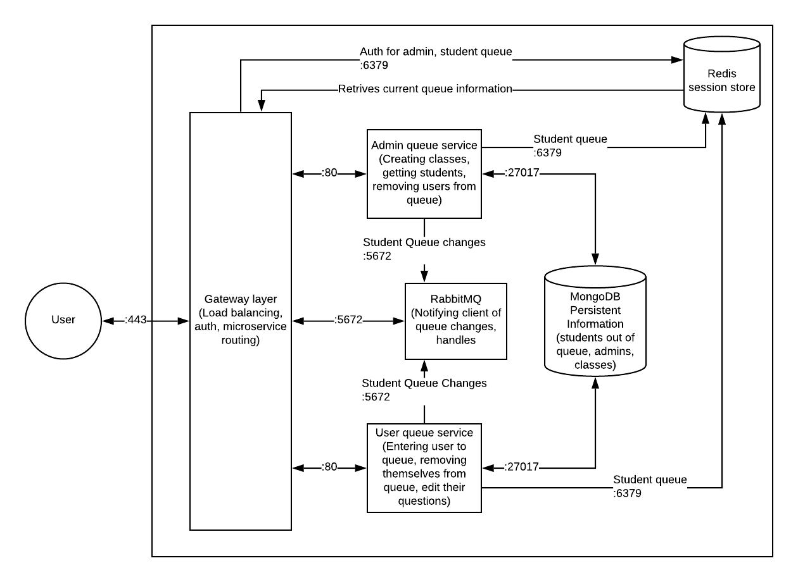

# QuestionQueue 
## Project Description
**QuestionQueue** is a queuing application focused towards tutoring individuals in the order questions appear as well as collecting usage data to determine what topics and subtopics may be a common pain point. 

**QuestionQueue** will be used in a lab section setting or during office hours by a TA/Tutor and multiple students. Students enter a queue with information about the class they are in, their question, and where they may be sitting. Students see what position they are in line. The TA/Tutor will be able to select a student to help (usually the first in line) and then they will be removed from the queue. This allows students who had a question first to have them answered first. 
 
Students benefit from using this application because they will have their questions answered fairly. There will be no bias as to how they are chosen to have their questions answered from where they may be sitting in class or other hidden biases. 

Teachers, TAs, and Tutors all benefit from this because they will be able to answer questions in a fair order, which will involve less time trying to keep track of who raised their hand first, avoiding students getting angry about raising their hand half a second later than someone else. Teachers will be able to see the data collected from the API and run analysis on what topics were hard for people to get, how to answer questions more efficiently, common repeated questions, etc. 

We as developers want to build this application so that it can be used in various classrooms for anyone to use. This code will be employed in the near future with a front end application in order to interact with current and future iSchool students. Working on this API will create a lasting impact in our community.

## Technical Description
### Infrastructure
The system will heavily rely on isolated *Docker container microservices*. Users will only have to interact with a website/domain container, where all requests will be forwarded to a separate request server container for access control. The request server then sends appropriate queueing and logging activities to a database container where queuing and submissions are kept tracked of.



<!-- https://www.lucidchart.com/invitations/accept/dbb3c7e4-ab54-4f04-a98f-eb88195d1be8 -->

### Use cases and priority

| Priority | User                  | Description                                                                                                                                                                                            |
| -------- | --------------------- | ------------------------------------------------------------------------------------------------------------------------------------------------------------------------------------------------------ |
| P0       | As a TA/tutor/teacher | I want to be able to view who is currently waiting for assistance on what topic for my class.                                                                                                          |
| P0       | As a student          | I want to be able to put myself in the queue so I can receive help from the faculty members in the timely manner.                                                                                      |
| P1       | As a TA/tutor/teacher | I want to be able to see where the student is sitting in a given room.                                                                                                                                 |
| P1       | As a student          | I want to be able to let the faculty members to see where am I sitting so I can receive help without sitting in a close vicinity with other students while being able to keep working on my questions. |
| P2       | As a TA/tutor/teacher | I want to be able to distill/summarize what are some most common questions that the students are experiencing so I can address them during TA/lab sessions.                                            |
| P3       | As a student          | I want to be able to modify my question or remove myself from the queue if I have figured out the problem and/or have a new problem.                                                                   |

### API Design

#### Endpoints

`/v1/student`: student control - GETting current queue position; POSTing new questions and enqueue. Student provides student id as query parameter `studentid`.
~~* `GET`: Get number of people in the queue and current position of active user~~
  ~~`200`; `application/json`: Successfully retrieves queue information and encodes queuing status in the body.~~
  ~~`401`: Cannot verify _student_ session ID or no _student_ session ID is provided.~~
  ~~`500`: Internal server error.~~~~ // Took this out because this is covered by the websocket - wk
* `POST`; `application/json`: Post new question and enqueue the user.
  * `201`; `application/json`: Successfully adds the question and enqueues the user; returns encoded question in the body.
  * `415`: Cannot decode body or receives unsupported body.
  * `500`: Internal server error.

`/v1/class`: class control
* `GET`: Get all classes.
  * `200`; `application/json`: Successfully retrieves all classes; returns the encoded list in the body.
  * `401`: Cannot verify _teacher_ session ID or no _teacher_ session ID is provided.
  * `500`: Internal server error.
* `POST`; `application/json`: Create new class.
  * `201`; `application/json`: Successfully creates a new class; returns encoded class in the body.
  * `401`: Cannot verify _teacher_ session ID or no _teacher_ session ID is provided.
  * `415`: Cannot decode body or receives unsupported body.
  * `500`: Internal server error.

`/v1/class/{class_number}`: specific class control
* `PATCH`; `application/json`: Update question types of a class; overwrites current types.
  * `201`; `application/json`: Successfully updates a class; returns updated, encoded class information in the body.
  * `401`: Cannot verify _teacher_ session ID or no _teacher_ session ID is provided.
  * `415`: Cannot decode body or receives unsupported body.
  * `500`: Internal server error.

`/v1/teacher`: TA/teacher control
* `POST`; `application/json`: Create new TA/teacher.
  * `201`; `application/json`: Successfully creates a new TA/teacher; returns encoded user model in the body.
  * `415`: Cannot decode body or receives unsupported body.
  * `500`: Internal server error.
* `PATCH`; `application/json`: Update information for a TA/teacher.
  * `200`: Successfully updates information for the user.
  * `401`: Cannot verify _teacher_ session ID or no _teacher_ session ID is provided.
  * `415`: Cannot decode body or receives unsupported body.
  * `500`: Internal server error.

`/v1/teacher/{teacher_id}`: specific TA/teacher control
* `GET`: Get TA/teacher information.
  * `200`; `application/json`: Successfully retrieves TA/teacher information; returns encoded user model in the body.
  * `401`: Cannot verify _teacher_ session ID or no _teacher_ session ID is provided.
  * `500`: Internal server error.

`/v1/teacher/login`: TA/teacher session control
* `POST`: Log in TA/teacher and returns session cookie.
  * `200`; `application/json`: Successfully logs in a TA/teacher; returns session ID in `Set-Cookie` header (?).
  * `401`: Cannot authenticate the provided credentials.
  * `415`: Cannot decode body or receives unsupported body.
  * `500`: Internal server error.
* `DELETE`: Log out a TA/teacher.
  * `200`: Successfully logs out a TA/teacher.
  * `401`: Cannot verify _teacher_ session ID or no _teacher_ session ID is provided.
  * `500`: Internal server error.

`/v1/queue`: websocket connection to notify users and teachers of the current queue. Student provides student id as query parameter `studentid`.
* If the user connected with an auth token, we can assume the user is a teacher of a class, so when we emit the entire queue list to it and do so for subsequent users entering or leaving.
* If no auth token is provided, we only give them the user hashes of people in line.

`/v1/queue/{student_id}`: queue control for TA/teachers
* `DELETE`: Delete the student from the queue based on the provided `student_id`.
  * `200`: Successfully resolved the student's question and removed from queue.
  * `400`: `student_id` does not exist in the queue or has already been resolved.
  * `401`: Cannot verify _teacher_ session ID or no _teacher_ session ID is provided.
  * `500`: Internal server error.

#### Models

We will be utilizing MongoDB as our persistent data store. 

**Users**
 
`teacher`: Users will be represented in the database as follows. This is the model that will returned when a client requests, creates, or updates any user. 
```
{
  "id": "id_value",
  "email": "email",
  "hash": "password_hash",
  "firstname": "first_name",
  "lastname": "last_name"
}
```

`credentials`: Login credentials to be posted.
```
{
  "email": "email",
  "password": "raw_password"
}
```

The client will send this to the server to create a new account:
```
{
 "email": "email",
 "password": "password",
 "password_conf": "password confirmation",
 "firstname": "first name",
 "lastname": "last name"
}
```

**Questions**

`questions`: Questions will be represented in the database as follows. This is the model that will returned when a client requests, creates, or updates any question. 
```
{
  "id": "student_id",
  "name": "student_name",
  "class": "class_number",
  "topic": "topic_of_question",
  "problem": "question",
  "loc.x": "x-coord_of_location_in_lab",
  "loc.y": "y-coord_of_location_in_lab",
  "createdAt": "time_created",
  "resolvedAt": "time_resolved"
}
```

**Class**

`class`: New classes to be added.
```
{
  "class_number": "class_number",
  "question_type": [
    "types"
  ]
}
```

**Queue**

The main design decision here is that we would like to obfuscate the contents of the queue to regular students. In the future, we can explore non-obfuscation in order to provide a more collaborative queue environment, but for a minimum viable product we will create a basic system where students don't know who else is in line.

`queue`: (FOR STUDENTS) This is the model that is returned when a client (student) requests information about the queue.
```
{
  "queue": [
      {
          "id": "unique hash"
      }
  ]
}
```

`queue`: (FOR TEACHERS) This is the model that an teacher sees:
```
{
  "queue": [
      {
        "id": "student_id",
        "name": "student_name",
        "class": "class_number",
        "topic": "topic_of_question",
        "problem": "question",
        "loc.x": "x-coord_of_location_in_lab",
        "loc.y": "y-coord_of_location_in_lab",
        "createdAt": "time_created",
        "resolvedAt": "time_resolved"
      }
  ]
}
```
